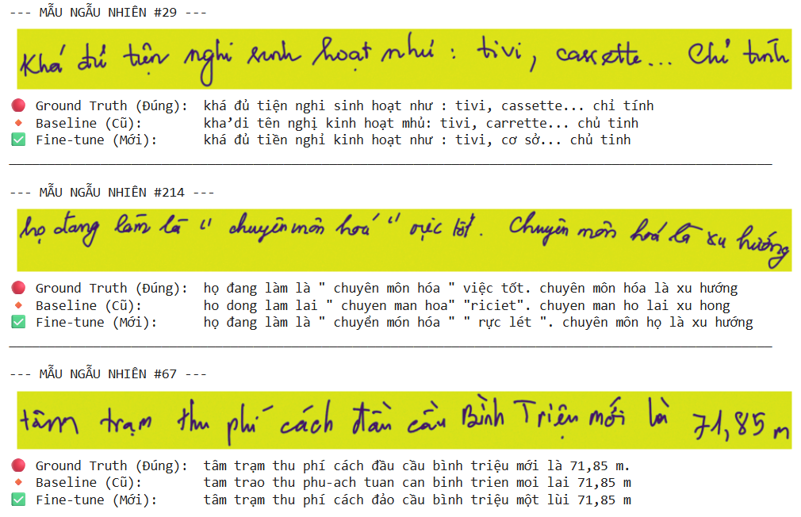

# Fine-tune-Deepseek-OCR-with-Vietnamese-Dataset

Course Project: **Introduction to Natural Language Processing**  
**University of Science, VNU-HCM**

**Student:** Phạm Quang Thịnh - Student ID: 23127485  
**Supervisor:** Dr. Nguyễn Hồng Bửu Long

---

## Introduction
This project focuses on fine-tuning the DeepseekOCR model (using the **Unsloth** library) on a Vietnamese handwritten text dataset. The goal is to improve Vietnamese text recognition performance (tone marks, cursive handwriting) and to standardize the output format.

## Results
After 150 training steps using the **QLoRA** technique, the model achieved significant improvements on an independent Test set (400 samples):

| Metric | Baseline (Original) | Fine-tuned (After training) | Improvement |
|:---|:---:|:---:|:---:|
| **CER** (Character Error Rate) | 31.92% | **14.05%** | ⬇️ 17.87% |
| **WER** (Word Error Rate) | 66.69% | **33.31%** | ⬇️ 33.39% |

| Metric | Baseline (%) | Fine-tuned (%) |
|:---|:---:|:---:|
| **Total CER** | 32.21 | **14.08** |
| Mean CER | 32.47 | 14.11 |
| Median CER | 28.11 | 12.22 |
| Min CER | 0.00 | 0.00 |
| Max CER | 131.11 | 75.00 |
| **Total WER** | 66.74 | **33.58** |

---

✅ **Improvement (Total CER):** Decrease **18.13%** on CER.
✅ **Improvement (Total WER):** Decrease **33.16%** on WER.

### Visual Comparison
Below are qualitative results on challenging handwritten samples:  
  
*(The fine-tuned model significantly improves tone mark accuracy and corrects meaningless words compared to the baseline model.)*

---

## Dataset
This project uses the **UIT-HWDB-line** dataset, which contains Vietnamese handwritten text images.

- **Original dataset source:** https://github.com/nghiangh/UIT-HWDB-dataset  
- **Dataset used in this project:** https://drive.google.com/file/d/1n6RlmUpaWamsniIJk3aU3XgBcAEinW-s/view?usp=drive_link

## Model Checkpoint
Due to GitHub storage limitations, the model weights (LoRA adapters) are hosted on Google Drive.  
**[DOWNLOAD THE MODEL HERE](https://drive.google.com/drive/folders/1pvL-O44_XUd2q6iMQXro8oBO42_Gh61S?usp=drive_link)**

---

## Usage

### 1. Environment Setup
```bash
pip install -r requirements.txt
```
### 2. Load Model & Inference
```bash
from unsloth import FastVisionModel

# Load model & tokenizer
model, tokenizer = FastVisionModel.from_pretrained(
    "path/to/checkpoint/folder",
    load_in_4bit=True,
)
FastVisionModel.for_inference(model)

# Run inference
image_path = "test_image.jpg"
instruction = "<image>\nFree OCR."
res = model.infer(
    tokenizer,
    prompt=instruction,
    image_file=image_path,
    output_path=output_path,
    base_size=1024,
    image_size=640,
    crop_mode=True,
    save_results=True,
    test_compress=False
)
```